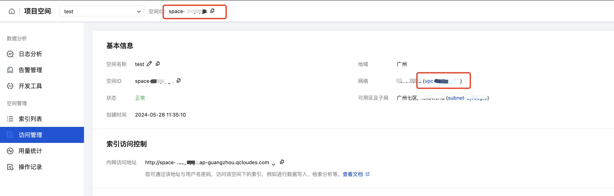

# 腾讯云 Elasticsearch Serverless 内嵌内网地址 DEMO

## Quick Start

1. 本机需要安装 NodeJS [官网地址](https://nodejs.org/en)
2. 命令行切换到当前目录，执行

```
npm install

npm run dev
```

3. 访问 demo 服务

```
http://localhost:5173/
```

4. 填入需要测试的 Space ID

- 注意，内网访问地址需要在与当前空间同一个 VPC 网络下才能够访问，可以在空间详情页的“访问控制”页面看到当前 VPC 信息，如下图：

  

5. 根据指引通过云 API `es:DescribeSpaceKibanaTools` 获取登录 Token， 填入到 Demo 中，点击“访问“
